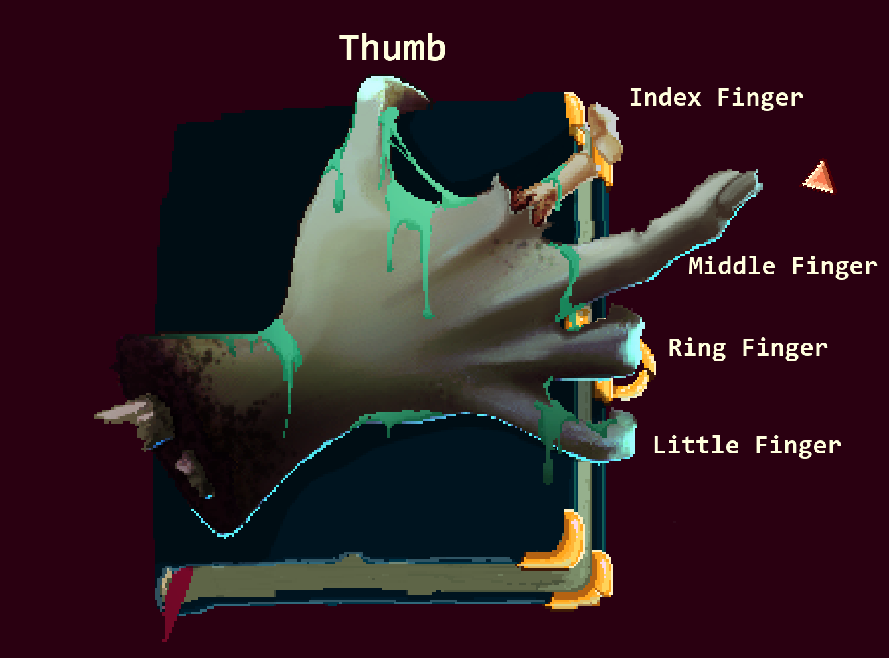

You're a barmaid - serving people alcohol is part of the job description.

# Who am I serving?
Butthair Pete, the man your father was just talking to. 

^[He's on the other side of the bar, but left-clicking while facing your dad will count as interacting with him.]

# And what am I serving him?
Rum, of course!

## Where is the rum?
Directly behind where you started, two bottles are side-by-side and can be picked up by left clicking on them.

^[Serve it by right-clicking while facing your dad.]

# What next?
Dad wanted you to deliver a bottle of rum to Granny Gabble.

# Where is the rum?
In the same spot as the first bottle, behind the bar and close to your starting point.

# Where is Granny Gabble?
She's not inside the bar.

Struggling to get out from behind the counter? ^[Left-click when facing the counter flap on the right.]

## I've looked everywhere. Where is Granny Gabble?
Outside of the bar, on the docks facing south - go to the far left of the bar and exit.

Don't forget why you were looking for her.

# No rest for the wicked
Dad wants you to help out in the kitchen.

# Where?
On the right side of the bar, through a door.

# What am I doing here?
Talk to the chef, Herbert, for instructions that you'll need to repeat.

^[You'll need to fetch him six fish from the net.]

# Quite unsanitary!
Well, the original owner of this logbook probably doesn't need it anymore - but he's got quite a grip!

## How do I pry the logbook from this cold, dead hand?
Click the fingers, and note that lifting some will press down others.

For a diagram labelling the fingers: ^[ ]

For an exact order to click the fingers in: ^[Ring Finger, Index Finger, Ring Finger, Little Finger, Index Finger, Ring Finger.]

# Alright, I have the book.
The kitchen's had a makeover - why not get a closer look? 

^[Read the bloody writing on the wall.]