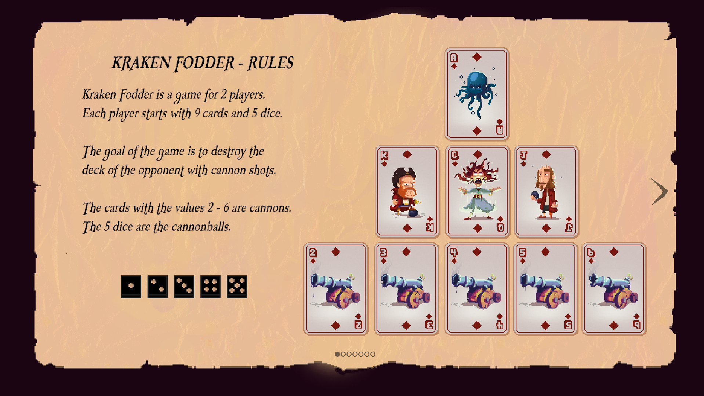
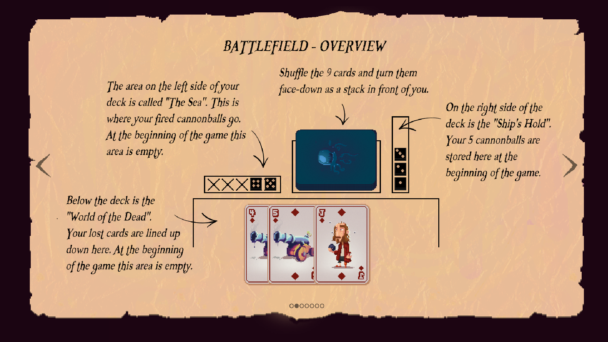
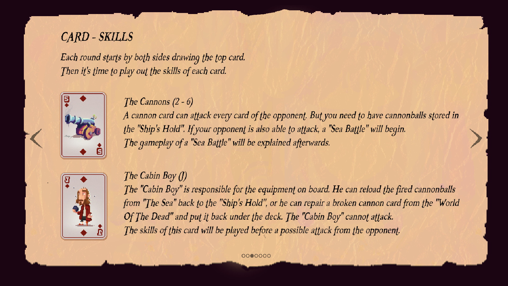
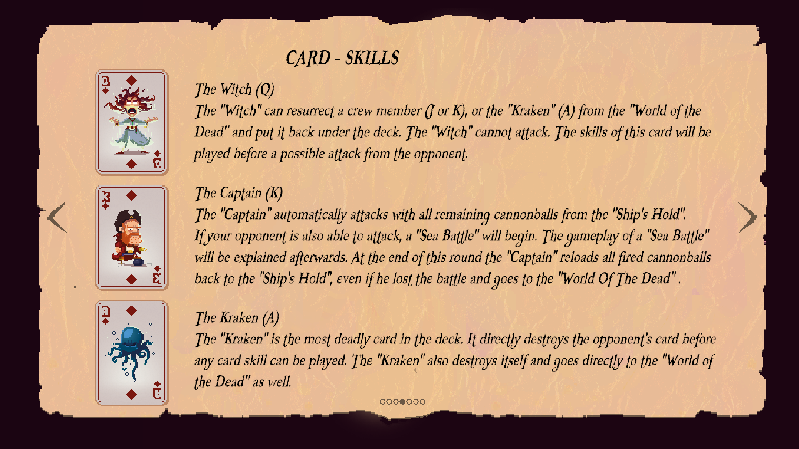
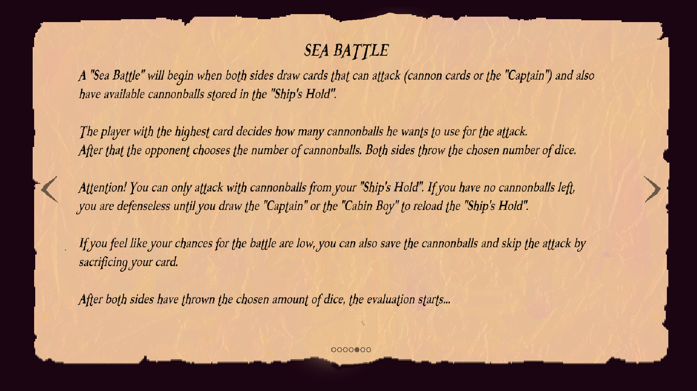
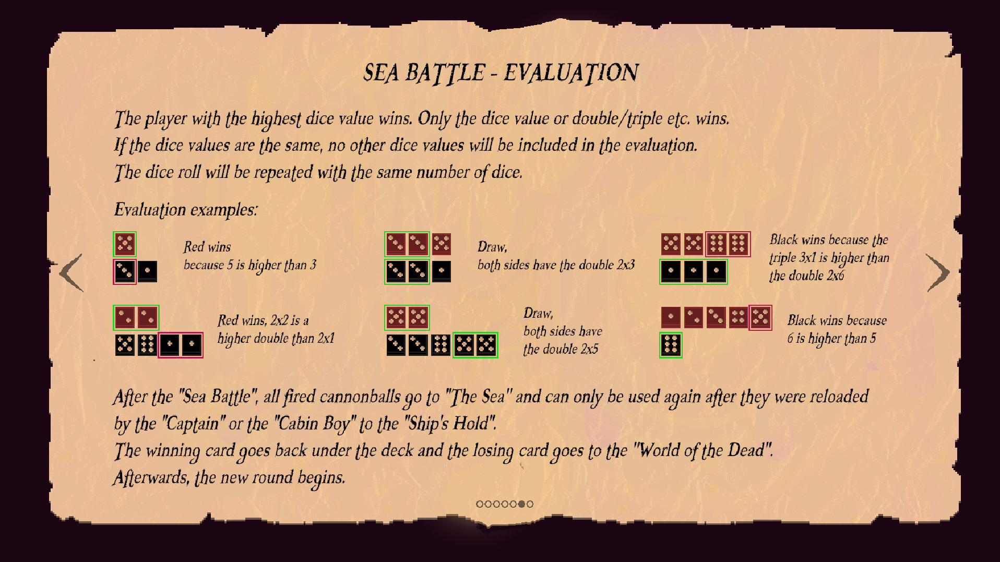
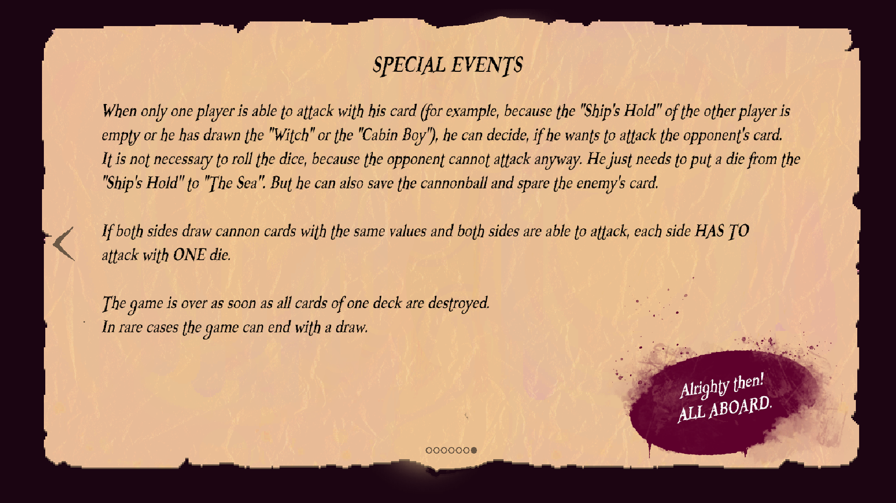

Who can teach you how to play the Kraken Fodder card game?

# Found him!
Erik will offer to tell you the rules before you begin playing - you can see them all below.

General rules - ^[ ]
Battlefield overview - ^[ ]
Cannon card & Cabin Boy card - ^[ ]
Witch, Captain and Kraken card - ^[ ]
Sea battle - ^[ ]
Sea battle evaluation - ^[ ]
Special events - ^[ ]

Don't worry if you're a bit confused for now - the game tells you what to do while playing the minigame.

# Alright, the game's over. What now? 
That was quite fun, eh? You've got two choices - either play with him again (and again, and again) or walk away.

## I've had my fill.
[Yikes, the boat's looking a bit more watery than usual!](afterkrakenfodder.md)