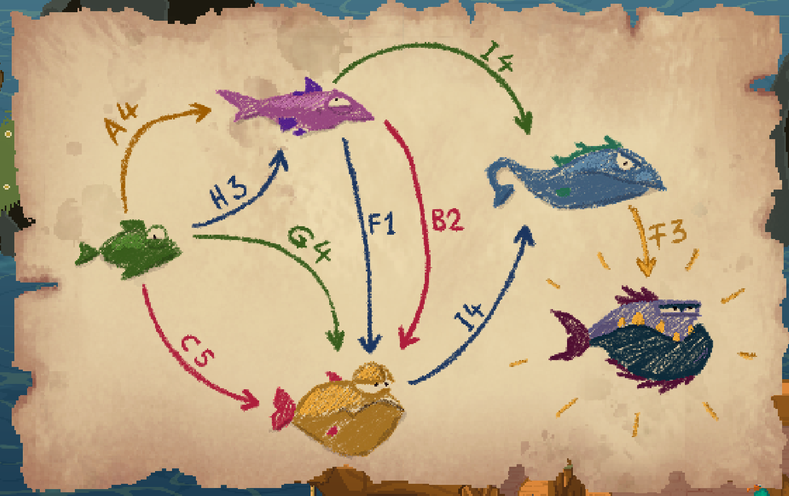

You've got the rod, you've got the bait - fishing time!

You can change your line's colour by using the top set of arrows, and change your bait by using the bottom set of arrows.

# Where can I use the fishing rod?

Spot 1 - ^[Below the lighthouse at McInally Palms, a stone path takes you down to a fishing spot.]
Spot 2 - ^[Island A4]
Spot 3 - ^[Island I4]
Spot 4 - ^[Anywhere on the open ocean!]

# I keep catching boots!
You can change your line's colour by using the top set of arrows.

Why not practice fishing here at McInally Palms?

# Caught a fish!
Well done, you got your first fish - and that greenish fish can be used as bait, too.

Remember that you can change your line's colour if you keep catching boots.

## How do I catch a different fish?
Use the greenish fish as bait with a red line.

## How do I catch another different fish?
Use the redish fish as bait with a green line.

Only reveal the next hint when you've heard tales of a specific fish.

## Can you give me a comprehensive guide to catching all the fish?
Using this image before finding it in-game is a sequence break, but if you're impatient, click the question mark below to reveal it.

^[ ]

## Can I get that image in a text format please?
Certainly.

Using a Green fish with a Red line in ocean spot C5 will get you a Yellow fish.
Using a Green fish with a Green line in ocen spot G4 will get you a Yellow fish.
Using a Green fish with a Yellow line on island A4 will get you a Red fish.
Using a Green fish with a Blue line in ocean spot H3 will get you a Red fish.

Using a Red fish with a Green line on island I4 will get you a Blue fish.
Using a Red fish with a Blue line in ocen spot F1 will get you a Yellow fish.
Using a Red fish with a Red line in ocean spot B2 will get you a Yellow fish.

Using a Yellow fish with a Blue line on island I4 will get you a Blue fish.

Using a Blue fish with a Gold line on McInally Palms will get you the ^[Gold-Tooth Piranha.]

# Where do I get the Gold line?
Have you seen a collection of rare things yet?

# No!
That's what you get for sequence breaking! Get back on the [intended path!](hotelguest.md)

## I have the gold-toothed piranha!
Great! Take it back to the restaurant on map space C1 for a rare item.