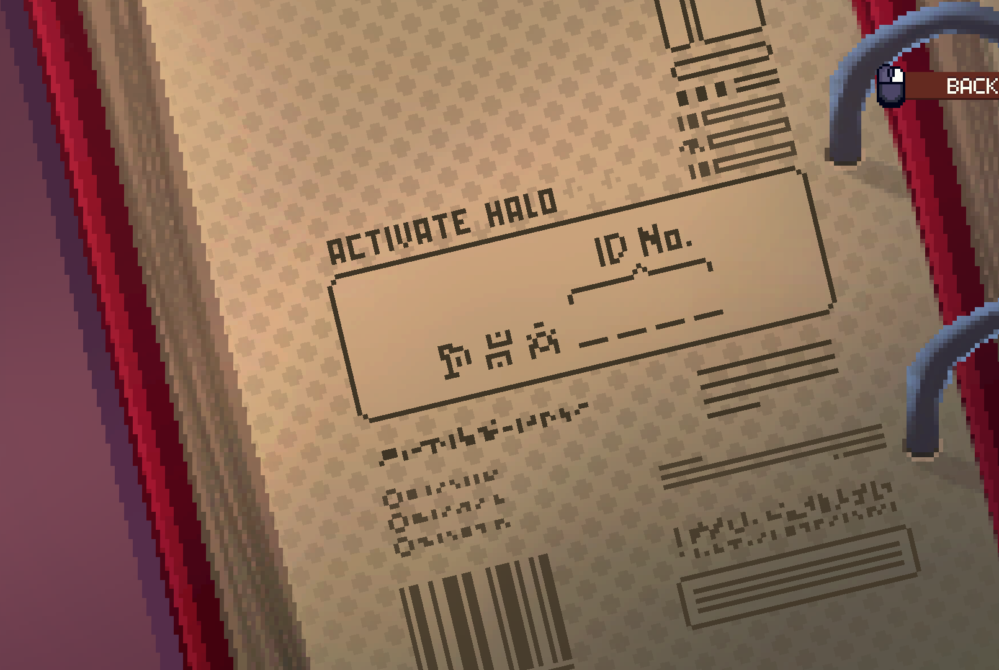

You're dead again, that's also something. But hell hath no fury like a Cleo scorned.

# Hellish bureaucracy! Again!
This time, you can't be spotted - so what can you use on this side of the room to help?

# Hmm..
You couldn't do much in here when Archibald was around - try interacting with everything you see.

## What am I looking for?
The file near the door - get a closer look, and click anything that seems useful.

# What do I do with this?
It's a video game, remember?

# Yes, and?
You can finally put a metal thingy into an electric thingy.

## What?
Put the paperclip into the junction box - there's two of them, so choose wisely.

# Ah, she's distracted!
Assuming you did not choose wisely, you know which one to put the paperclip into now. 

If not, look closely at what's on your side of the room. 

## She's distracted - now what?
Her back is turned, so take the opportunity to look at the book she put on the desk.

# What are these symbols?
They must be some form of afterlife numbering - and four numbers are missing.

# Do I need to guess the solution?
No, you may have even seen the numbers you need already - very recently.

## Where do I find the numbers I need?
On the file sticking out of the folder.

# Okay, number noticed - now what?
When you distracted Jichomilele a second time, she moved the book.

## Good for her. How does that help me?
So, the book stayed in the middle of the desk was when she was distracted the first time - leaving the keypad wide open!

If you forgot the file number - ^[The number on the file is 1365.]

## Hmm...
So, you entered 1-3-6-5 and it didn't work. What's up with that?

The book had some numbers pre-written into it - click the question mark to see them. ^[ ]

You'll need to remember the symbols / numbers, and type them into the keypad before typing 1-3-6-5.

## She's turning around too fast - what do I need to type in?
7-1-4-1-3-6-5.

# Thanks for playing and reading!
These hints have been written by Kieron West- thanks for reading! I hope you enjoyed them, and the game!